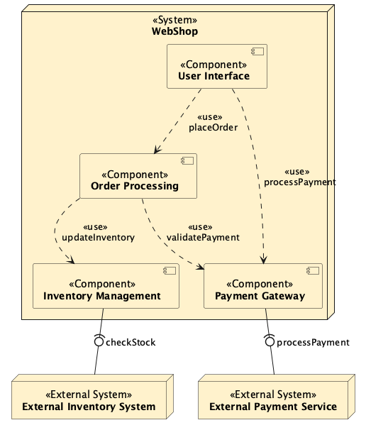

# Diagrams with include

Here is another one:



Und noch mal inline:

```plantuml
@startuml DokChess structure
'TODO: This does not work with VSCode Markdown preview, but with the "Plantuml: Preview Current Diagram" command
!include documentation/diagrams/src/color.puml

'left to right direction

node "**WebShop**" <<System>> as ws {
    Component "**User Interface**" <<Component>> as ui
    Component "**Order Processing**" <<Component>> as op
    Component "**Payment Gateway**" <<Component>> as pg
    Component "**Inventory Management**" <<Component>> as im
}
node "**External Payment Service**" <<External System>> as eps 
node "**External Inventory System**" <<External System>> as eis 

ui ..> op  :<<use>> \n placeOrder
ui ..> pg  :<<use>> \n processPayment
op ..> pg  :<<use>> \n validatePayment
op ..> im  :<<use>> \n updateInventory
pg -(0- eps: processPayment
im -(0- eis: checkStock

@enduml
```
